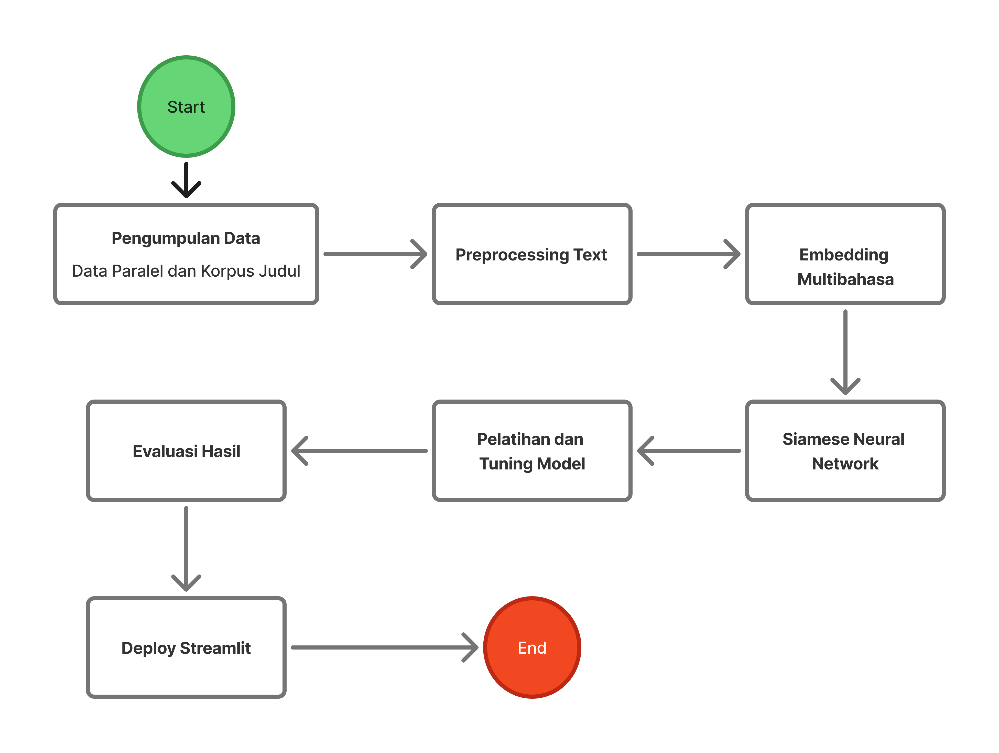

# Sistem Pencarian Semantik Lintas-Bahasa (Cross-Lingual Semantic Search)

**Authors:** Muhammad Arsal Ranjana Utama, Syalaisha Andini Putrianyah, Nabila Zakiyah Zahra
*(Institut Teknologi Sumatera)*

[](https://bilingual-search-engine-9rhcjuu5pcwfkmmwnufp7v.streamlit.app/)
**🔴 Live Demo:** [Click here to try the App](https://bilingual-search-engine-9rhcjuu5pcwfkmmwnufp7v.streamlit.app/)


## 📌 Abstract
This project implements a **Cross-Lingual Semantic Search System** designed to find English research papers using Indonesian queries (and vice versa). It addresses the limitations of keyword-based search by leveraging a **Siamese Neural Network** with **Bidirectional LSTM (BiLSTM)** and **FastText Aligned Embeddings** to capture semantic similarity across languages.

Despite working in a severe **low-resource setting** (only 404 parallel training pairs), the model achieves stable training stability and demonstrates the potential of lightweight neural architectures for cross-lingual retrieval.

## 🛠️ Methodology & Architecture

### 1. System Flowchart


### 2. Model Architecture
We constructed a **Siamese Neural Network** from scratch with the following components:
* **Embedding Layer:** Pre-trained **FastText Aligned Vectors** (`wiki.id` & `wiki.en`), frozen during training to retain cross-lingual alignment.
* **Encoder:** **Bidirectional LSTM (BiLSTM)** to capture sequential context from both directions.
* **Pooling:** Global Average Pooling to produce a fixed-size sentence vector.
* **Loss Function:** **Multiple Negatives Ranking Loss (MNRL)**, optimized for retrieval tasks by maximizing the distance between positive and negative pairs in a batch.

### 3. Data (The Bottleneck)
* **Training Data:** 404 pairs of manually curated Indonesian-English abstracts.
* **Search Corpus:** ~15,000 English scientific titles.

## 📊 Experiments & Results

### Hyperparameter Optimization (Grid Search)
We performed a Grid Search to find the optimal configuration. The best performance was achieved with:
* **LSTM Units:** 128
* **Learning Rate:** 1e-4
* **Dropout:** 0.2
* **Validation Loss:** ~2.66 (lowest recorded).

### Performance Analysis
While the model trained stably (Validation Loss dropped from 3.46 to 2.68), qualitative analysis revealed critical insights into **Low-Resource constraints**:

| Query (ID) | Top Result (EN) | Cosine Score | Relevance | Analysis |
| :--- | :--- | :--- | :--- | :--- |
| *"Implementasi Business Intelligence"* | *"Social-LLM: Modeling User..."* | **0.7993** | ❌ Low | **Partial Lexical Mapping:** The model recognized "Intelligence" (AI context) but failed to grasp "Business Intelligence" as a specific IS concept. |
| *"Klasifikasi sentimen LSTM"* | *"Low-cost Eye Gaze Detection"* | **0.7765** | ❌ Low | **OOV Problem:** "LSTM" was not in the small training set (N=404), causing the model to rely on static embeddings without context. |

**Conclusion:** The high cosine scores (>0.75) despite low relevance indicate that **Data Scarcity** is the primary bottleneck. The model requires more parallel data to generalize semantic concepts beyond simple word matching.

## 🚀 Deployment

The application is deployed on Streamlit Cloud.
**🔗 [Access the Live App Here](https://bilingual-search-engine-9rhcjuu5pcwfkmmwnufp7v.streamlit.app/)**

### How to Run Locally (Docker)
1.  **Clone the Repository**
    ```bash
    git clone [https://github.com/ArsalU/bilingual-search-engine.git](https://github.com/ArsalU/bilingual-search-engine.git)
    cd bilingual-search-engine
    ```

2.  **Run with Docker**
    ```bash
    docker build -t bilingual-search .
    docker run -p 8501:8501 bilingual-search
    ```

3.  **Access the App**
    Open `http://localhost:8501` in your browser.

---
*Based on the paper: "Sistem Pencarian Semantik Lintas-Bahasa (Cross-Lingual Semantic Search) untuk Judul Karya Ilmiah (Indonesia-Inggris)".*
